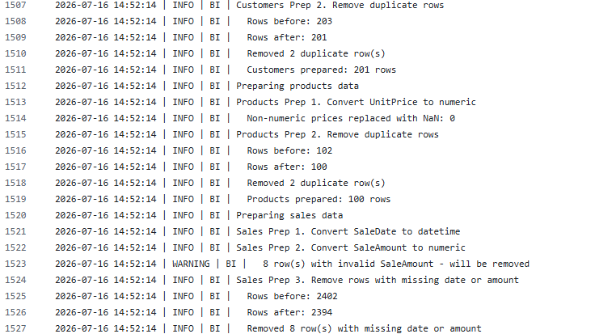
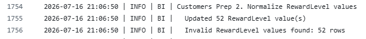
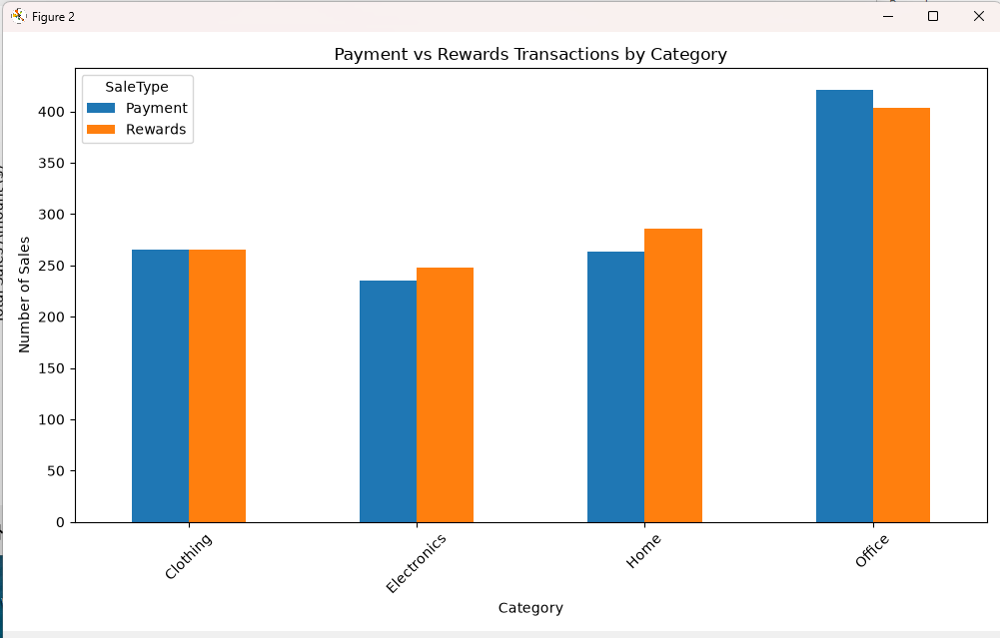

# Project Documentation

This site provides project documentation.
Use the documentation navigation to explore.

## How-To Guide

Many instructions are common to all our projects.

See
[⭐ **Workflow: Apply Example**](https://denisecase.github.io/pro-analytics-02/workflow-b-apply-example-project/)
to get the example projects running on your machine.

## Project Documentation Pages (docs/)

- **Home** - this documentation landing page
- [**Project Instructions**](./project-instructions.md)  - the standard project workflow
- [**Your Files**](./your-files.md) - how to copy the example and create your version
- [**Glossary**](./glossary.md) - project terms and concepts
- [**API**](./api.md) - autogenerated code documentation for the public project interface

## Phase 4/5 Technical / Custom Project Modification
### Basis and Data

Describe the raw data you started with.

Include:

- The three smart sales data files and their known quality issues
  - customers_data.csv, products_data.csv, and sales_data.csv. Each dataset contained common data quality issues such as missing values, inconsistent formatting, duplicate records, and incorrect data types that required cleaning before analysis.

- Which issues you chose to address and which you deferred
  - I chose the common issues, such as inconsistent formatting, duplicate records and incorrect data types, and missing values
- Any important assumptions about what counts as valid data: no

### Cleaning Approach

Describe the ETVL preparation steps you implemented.

Include:

  For the customers table, duplicate records were removed, missing values were handled, and data types were standardized. As a custom enhancement, I added a new calculated field named RewardLevel, which categorizes customers into loyalty levels based on their reward point totals.

  The products and sales tables were cleaned using the standard project preparation scripts to ensure consistent formatting, remove invalid records, and prepare the data for analysis.

  Before saving the prepared datasets, I verified that the scripts executed successfully, the output files were created without errors, and the new RewardLevel field appeared correctly in the prepared customer data.

### Before and After

Describe the impact of your cleaning work.

Include:

- How many rows were removed or corrected in each table
  - customers_data_prepared,csv had 2 rows deleted
  - products_data_prepared.csv had 2 rows deleted
  - sales_data_prepared.csv had 8 rows deleted
  - customers_data_prepared_rewardlevel.csv had 52 values updated
- What the data looked like before and after

## Phase 5. Custom Project

Is basically included in Project 4 for data cleaning. I didn't just add two new attributes I transformed invalid data by using Business Logic.

For my Custom Project,
I used the cleaned data and created a new visualization using a new column added 'SaleType' which used Payment or Rewards as a value.

I then went and created another visualization chart asking a new Business Question - Which product categories have the highest number of Payment or Rewards transactions?

